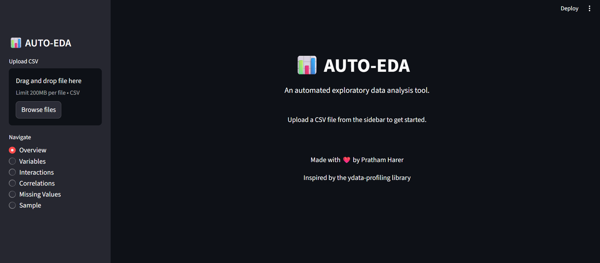
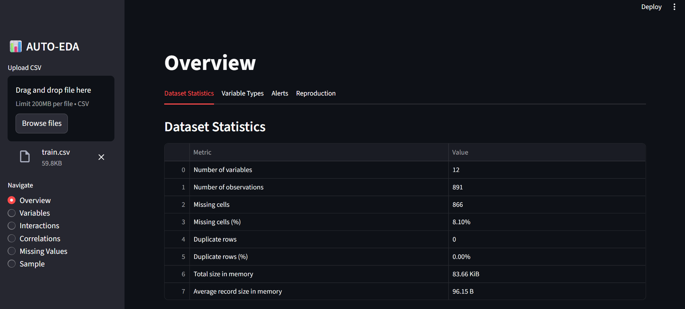
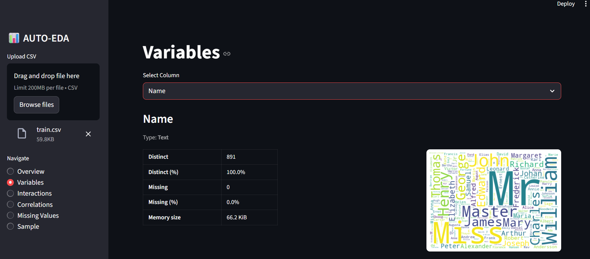
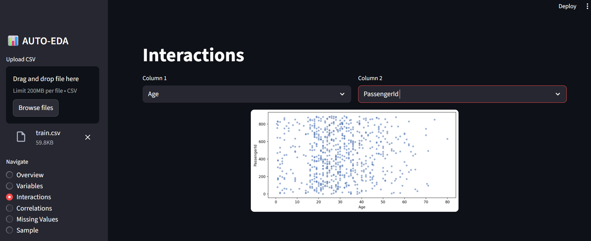
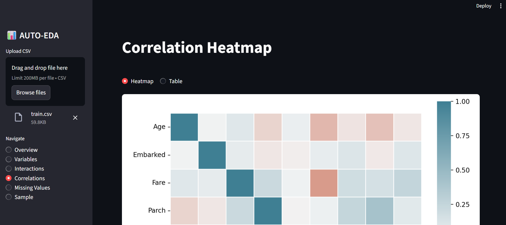
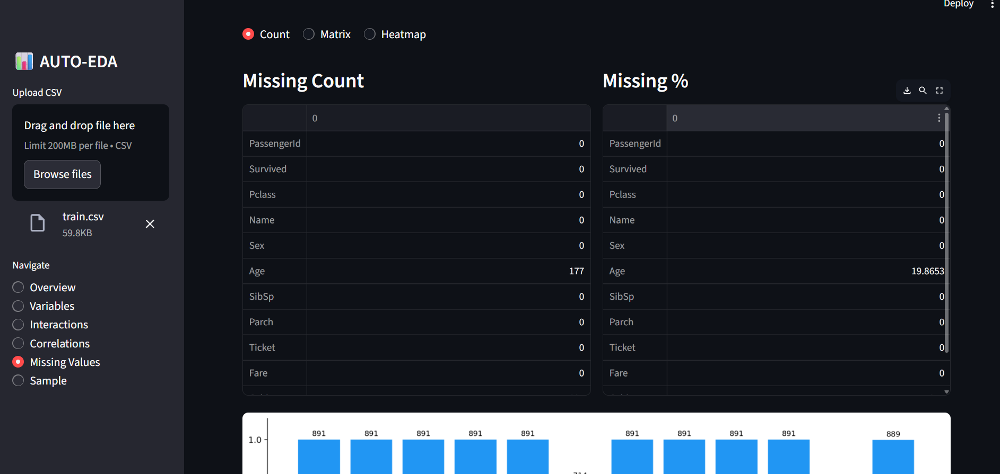
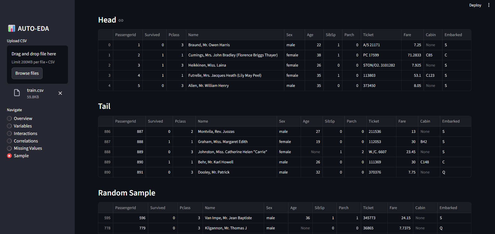

<h1 align="center">📊 AUTO-EDA</h1>

---

<h2 align="center">Automated Exploratory Data Analysis Web Application</h2>

---

## 📌 Project Overview

AUTO-EDA is an automated exploratory data analysis tool built to extract meaningful insights from any CSV dataset — instantly.

The objective of this project is to replicate the core functionality of `ydata-profiling` through a clean, interactive Streamlit web interface built from scratch using Python.

The complete workflow covers automatic column type detection, statistical profiling, correlation analysis, missing value detection, and dynamic visual reporting — all without writing a single line of analysis code.

---

## 📈 Application Preview

### Dashboard Interface



### Overview



### Variables



### Interaction



### Correlation



### Missing Values



### Sample



---

## 🎯 Problem Statement

Raw CSV datasets require significant manual effort to understand — column types, distributions, correlations, and missing values all need separate investigation.

The challenge was to:

* Automatically detect column types (Numeric, Categorical, Text)
* Extract meaningful statistical metrics per column
* Identify correlations across all variable types
* Detect and visualize missing value patterns
* Build an interactive, multi-page analytical interface

This project focuses on transforming raw tabular data into structured analytical insights through automated pipelines.

---

## 📊 Dataset

* Format: `.csv` (Any user-uploaded CSV file)
* Type: Structured tabular data
* Source: User-uploaded via Streamlit sidebar
* Supports: Numeric, Categorical, and Text columns

Note: No dataset is stored in this repository. Upload your own CSV to explore.

---

## ⚙️ Tools & Technologies Used

* **Python** – Core programming language
* **Pandas** – Data cleaning, transformation, aggregation
* **Matplotlib** – Statistical plotting and chart generation
* **Seaborn** – Heatmaps and advanced visualizations
* **WordCloud** – Text frequency visualization
* **Missingno** – Missing value matrix and heatmap
* **Scikit-learn** – Label encoding for correlation analysis
* **Streamlit** – Interactive multi-page web application

---

## 🧱 Workflow Architecture

```
Raw CSV Upload
→ Column Type Detection (Numeric / Categorical / Text)
→ Statistical Profiling (per column)
→ Alert Generation (Missing, Zeros, Unique, Correlation)
→ Interaction & Correlation Analysis
→ Missing Value Visualization
→ Interactive Dashboard (Streamlit)
```

---

## 📊 Analytical Features Implemented

* **Overview** — Dataset statistics, variable type breakdown, smart alerts, reproduction info
* **Variables** — Per-column profiling with stats table and type-appropriate chart
* **Interactions** — Scatter plot between any two numeric columns
* **Correlations** — Heatmap and correlation table (encodes categorical columns automatically)
* **Missing Values** — Count bar chart, nullity matrix, and nullity heatmap
* **Sample** — Head, tail, and random sample of the dataset

---

## 🚨 Smart Alerts

AUTO-EDA automatically flags:

* ⚠️ Columns with missing values (count + percentage)
* 🔵 Numeric columns with high zero count
* 🔴 Columns with all unique values
* 🔴 Uniformly distributed numeric columns
* ⚫ Highly correlated column pairs (threshold > 0.5)

---

## 📂 Project Structure

```
AUTO-EDA/
│
├── app.py                  → Main Streamlit Application
│
├── utils/
│   ├── overview.py         → Dataset statistics & column classification
│   ├── variables.py        → Column type detection logic
│   ├── plots.py            → All plot/chart generation functions
│   ├── correlation.py      → Correlation heatmap logic
│   └── missing.py          → Missing value analysis functions
│
├── requirements.txt        → Dependencies
└── images/                 → Screenshots and architecture diagrams
```

---

## ▶ How to Run the Application

1. Clone the repository:

```
git clone https://github.com/<your-username>/auto-eda.git
```

2. Install dependencies:

```
pip install -r requirements.txt
```

3. Run the Streamlit app:

```
streamlit run app.py
```

4. Upload any CSV file from the sidebar and explore your data instantly.

---

## 📦 Requirements

```
streamlit
pandas
matplotlib
seaborn
wordcloud
missingno
scikit-learn
```

Install all at once:

```
pip install -r requirements.txt
```

---

## 💡 Key Learning Outcomes

* Automatic column type classification using statistical heuristics
* Replicating ydata-profiling functionality from scratch
* Encoding categorical and text variables for correlation analysis
* Building multi-page Streamlit applications with modular utility functions
* Type-aware visualization selection (histogram / bar chart / wordcloud)
* Missing value analysis using missingno library

---

## 🔗 Important Links

### 🚀 Live Streamlit Application

Access the deployed app here:
[[Try](https://auto-eda-profilier.streamlit.app/)]

### 📖 Medium Blog (Detailed Project Explanation)

Read the full case study here:
[Add Medium Blog Link Here]

### 📊 Project Presentation (PPT Slides)

View the presentation slides here:
[Add Presentation Link Here]

### 🎥 YouTube Walkthrough (Application Demo & Explanation)

Watch the full project demo here:
[Add YouTube Demo Link Here]

---

<p align="center">Made with ❤️ by <b>Pratham Harer</b> • AUTO-EDA</p>
